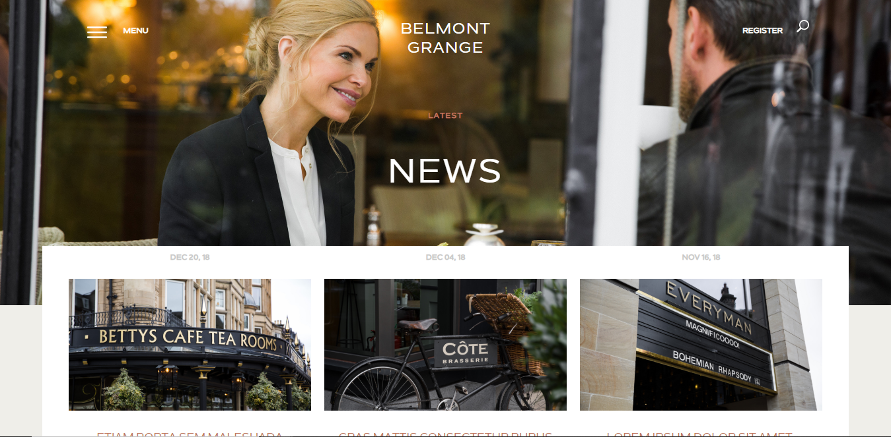
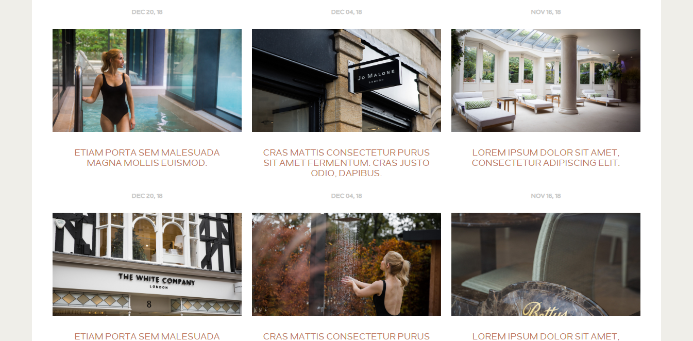
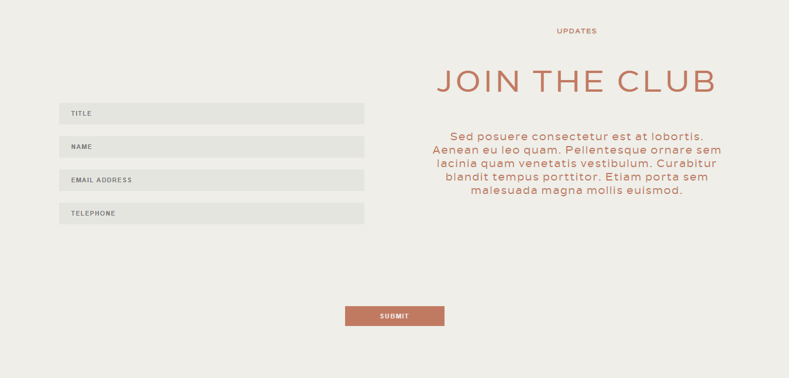
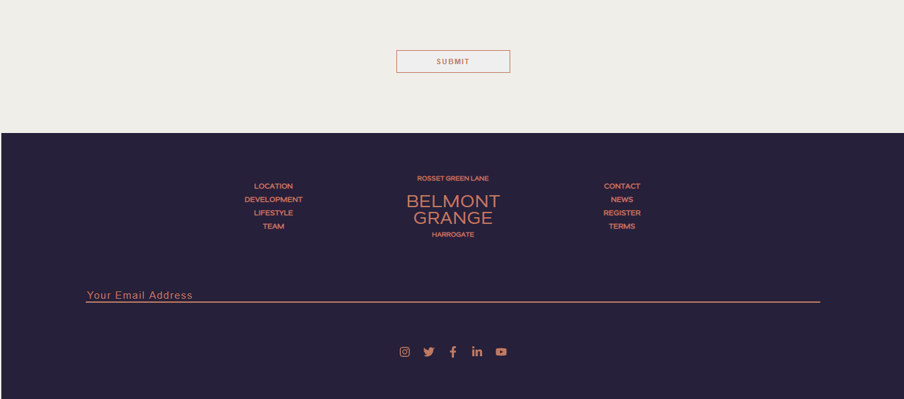
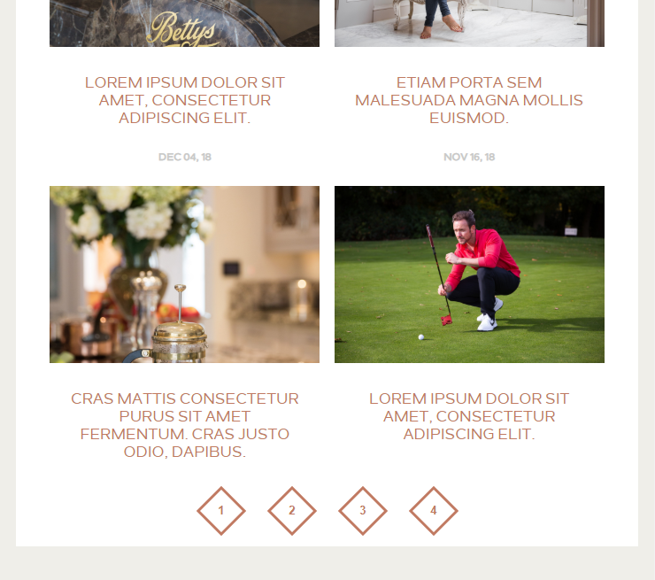

### Website Template

This is a responsive website template for a company named Belmont Grange. It was made using React.

# How to run the project

Clone the project and then access to the folder. You have to run `npm install` on your terminal.

Then, run `gatsby develop` and the project will stat. 
Open your browser and go to `localhost:8000` to open the template.

# Tools used

  - I have used [Gatsby](https://www.gatsbyjs.org/) to build the project.
  - I have used [react-bootstrap-grid](https://www.npmjs.com/package/styled-bootstrap-grid) for the grid.
  - I have used [style-components](https://styled-components.com/) for the styles.